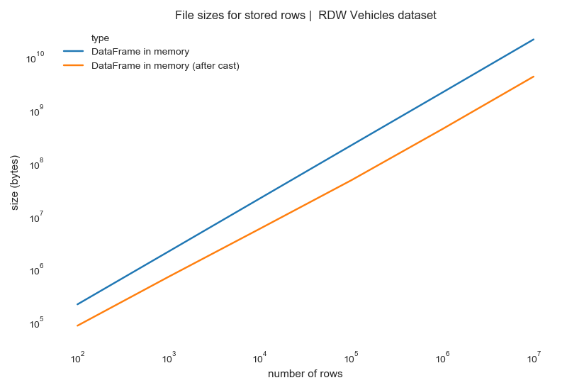
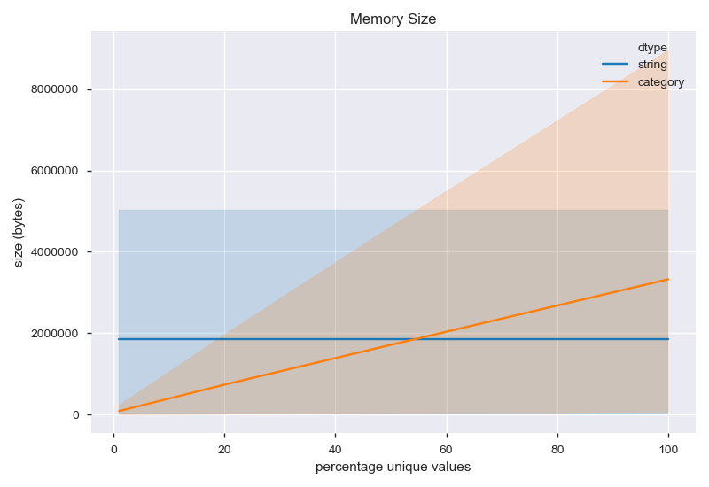
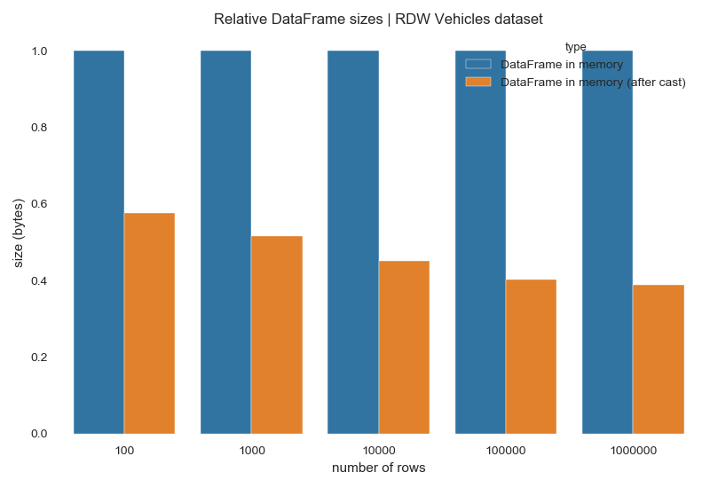
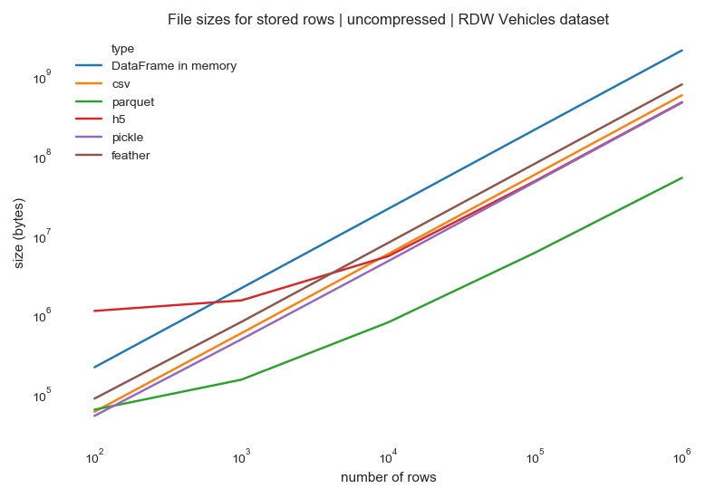

Data Compression
================

Decoupling *semantic* data types from *physical* data types makes it easier to compress variables.
For this example we restrict ourselves to in-memory compression.
Our task is to automatically obtain an efficient in-memory representation, to minimize the RAM used, while preserving the same semantic type.

Two characteristics of the types provide us space to compress:

- Semantic types restrict the possible values of a variable (the URL type is a subset of String).
- The type system infers the exact semantic type independent of physical subtype (int64 and int32 are both Count)

Example
-------

The following example demonstrates how in-memory compression works on a real-life dataset using `visions`.
The full code for the example can be found `here <../../../examples/compression_proof_of_concept/>`_.

Dataset
-------
The data is taken from the RDW (the Dutch DMV) through the `say-hello <https://github.com/dylan-profiler/say-hello>`_ package.
It records all (registered) vehicles in the Netherlands.
The file is provided as .csv with a file size of 7.1 GB.
The set has 64 variables including booleans, integers, urls and dates.
The data is messy, as we can expect from real-world data.
There are missing values, variable types are not standardized etc.
For a more elaborate description of the dataset, we refer the reader to it `pandas-profiling <https://github.com/pandas-profiling/pandas-profiling>`_ report which can be found: `here <http://github.com/dylan-profiler/say-hello/>`_.

Baseline
--------

Any meaningful compression of the data should have a lower RAM usage.
To be able to compare, we measure the usage of the dataframe without any preprocessing.
We are also interested in how the compression scales with the number of rows.

   File sizes per file type (RDW Vehicles data set) on disk.

Type compression
----------------

Within types
############

Examples: integer, categorical/string

Plot to determine when to encode categorical values as string and when as categorical.

   pandas string and categorical memory size as function of percentage of unique values.

Between types
#############

Examples: float->int

Verifying the typeset
---------------------

`visions` provides us with tools to verify whether our typeset behaves as intended.

Type Inference Report
#####################

The `type_inference_report_frame` reports the changes before and after type inference given a typeset.
This report is useful for catching various errors, for example that all types are visions_generic or that string columns containing dates have not changed.

.. code-block:: python

   from visions.core.functional import type_inference_report_frame
   report = type_inference_report_frame(df, rdw_typeset)
   print(report)

::

   Maximum ondersteunende snelheid                        visions_float                  != visions_integer
   Cilinderinhoud                                         visions_float                  != visions_integer
   Plaats chassisnummer                                   visions_string                 != visions_categorical[str]
   Typegoedkeuringsnummer                                 visions_string                 == visions_string
   Vermogen massarijklaar                                 visions_float                  == visions_float
   Merk                                                   visions_string                 != visions_categorical[str]
   Openstaande terugroepactie indicator                   visions_string                 != visions_categorical[str]
   Afstand hart koppeling tot achterzijde voertuig        visions_float                  != visions_integer
   Handelsbenaming                                        visions_string                 == visions_string
   Inrichting                                             visions_string                 != visions_categorical[str]
   API Gekentekende_voertuigen_voertuigklasse             visions_string                 != visions_categorical[str]
   Aanhangwagen autonoom geremd                           visions_float                  != visions_integer
   Massa rijklaar                                         visions_float                  != visions_integer
   Aantal cilinders                                       visions_float                  != visions_integer
   Eerste kleur                                           visions_string                 != visions_categorical[str]
   Datum eerste afgifte Nederland                         visions_integer[with_datetime] != visions_date
   Aantal deuren                                          visions_float                  != visions_integer
   API Gekentekende_voertuigen_carrosserie                visions_string                 != visions_categorical[str]
   Kenteken                                               visions_string                 == visions_string
   Aantal wielen                                          visions_float                  != visions_integer
   Taxi indicator                                         visions_string                 != visions_categorical[str]
   Europese voertuigcategorie toevoeging                  visions_string                 != visions_categorical[str]
   Massa ledig voertuig                                   visions_float                  != visions_integer
   Maximale constructiesnelheid (brom/snorfiets)          visions_float                  != visions_integer
   Lengte                                                 visions_float                  != visions_integer
   Type                                                   visions_string                 != visions_categorical[str]
   Maximum massa samenstelling                            visions_float                  != visions_integer
   Toegestane maximum massa voertuig                      visions_float                  != visions_integer
   Voertuigsoort                                          visions_string                 != visions_categorical[str]
   WAM verzekerd                                          visions_string                 != visions_categorical[str]
   Catalogusprijs                                         visions_float                  != visions_integer
   API Gekentekende_voertuigen_brandstof                  visions_string                 != visions_categorical[str]
   Maximum trekken massa geremd                           visions_float                  != visions_integer
   Aantal rolstoelplaatsen                                visions_float                  != visions_bool[nl]
   Europese voertuigcategorie                             visions_string                 != visions_categorical[str]
   Type gasinstallatie                                    visions_string                 != visions_categorical[str]
   Aantal zitplaatsen                                     visions_float                  != visions_integer
   Aantal staanplaatsen                                   visions_float                  == visions_float
   Breedte                                                visions_float                  != visions_integer
   API Gekentekende_voertuigen_assen                      visions_string                 != visions_categorical[str]
   Datum eerste toelating                                 visions_integer[with_datetime] != visions_date
   Datum tenaamstelling                                   visions_integer[with_datetime] != visions_date
   Oplegger geremd                                        visions_float                  != visions_integer
   Bruto BPM                                              visions_float                  != visions_integer
   Vervaldatum tachograaf                                 visions_float                  != visions_integer
   Afwijkende maximum snelheid                            visions_float                  == visions_float
   Uitvoering                                             visions_string                 == visions_string
   Europese uitvoeringcategorie toevoeging                visions_string                 != visions_categorical[str]
   Export indicator                                       visions_string                 != visions_categorical[str]
   Variant                                                visions_string                 == visions_string
   Aanhangwagen middenas geremd                           visions_float                  != visions_integer
   Vervaldatum APK                                        visions_float                  != visions_integer
   Wielbasis                                              visions_float                  != visions_integer
   Wacht op keuren                                        visions_string                 != visions_categorical[str]
   Vermogen (brom/snorfiets)                              visions_float                  == visions_float
   API Gekentekende_voertuigen_carrosserie_specifiek      visions_string                 != visions_categorical[str]
   Zuinigheidslabel                                       visions_string                 != visions_categorical[str]
   Technische max. massa voertuig                         visions_float                  != visions_integer
   Volgnummer wijziging EU typegoedkeuring                visions_float                  != visions_integer
   Maximum massa trekken ongeremd                         visions_float                  != visions_integer
   Laadvermogen                                           visions_float                  != visions_integer
   Tweede kleur                                           visions_string                 != visions_categorical[str]
   Retrofit roetfilter                                    visions_string                 != visions_categorical[str]
   Afstand voorzijde voertuig tot hart koppeling          visions_float                  != visions_integer
   In total 55 out of 64 types were changed.

Relation graph plot
###################

.. code-block:: python

   rdw_typeset.output_graph("rdw_typeset.svg")

.. figure:: ../../../../examples/compression_proof_of_concept/rdw_typeset.svg
   :width: 700 px
   :align: center
   :alt: RDW Typeset Relations

Results
-------

   File sizes per file type (RDW Vehicles data set) in memory.

   File sizes per file type (RDW Vehicles data set) in memory.

Outlook
-------

   File sizes per file type (RDW Vehicles data set) on disk.

Tom Augspurger implemented a ip-address data type for pandas that efficiently stores ip-addresses (as numbers) [1]_, [2]_, [3]_.

.. [1] Tom Augspurger, Extension Arrays for Pandas, 12 February 2018, https://tomaugspurger.github.io/pandas-extension-arrays.html
.. [2] Tom Augspurger, CyberPandas: Extending Pandas with Richer Types, 16 May 2018, https://www.anaconda.com/cyberpandas-extending-pandas-with-richer-types/
.. [3] Tom Augspurger, Cyberpandas package on Github, https://github.com/ContinuumIO/cyberpandas