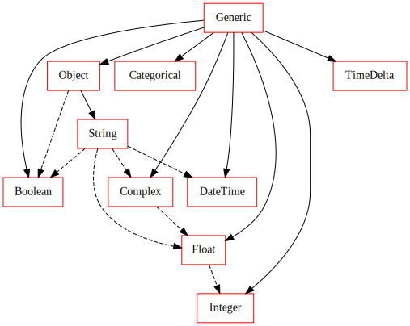

Graph view
==========

In ``visions`` relationships between types are formalized through graph.
The base data structure of a typeset is a `directed rooted tree <https://en.wikipedia.org/wiki/Tree_(graph_theory)#Rooted_tree>`_ (graph).
Each node represents a `data type <../getting_started/concepts.html#type>`_.
The root note is ``Generic``.

Each data type is associated with a set.
The root node is associated with the universal set

:math:`U = \{\textrm{all data structures supported by a Series}\}`.

* Each data type's set must be a proper subset of the parent's set.
* Membership of a data type is defined as membership of that set.

Symbolically : :math:`f: \textrm{Type} \times S \to \{True, False\}`.

In order for graph traversal to be decidable membership of siblings must be mutually exclusive.

This is the same as saying sets of any two pairs of data types with the same parent must be disjoint, except for the missing value indicator.

For example, the ``Path`` and ``URL`` data type both have the parent data type ``Object`` i.e.
:math:`\textrm{Path} \setminus \{\textrm{None}\} \cap \textrm{URL} \setminus \{\textrm{None}\} = \emptyset`.

For the three default typesets, this base structure can be visualised as:

.. figure:: ../../../../src/visions/visualisation/typesets/typeset_standard_base.svg
   :width: 700 px
   :align: center
   :alt: Visualisation of the base data structure of the *StandardSet*.

   Visualisation of the base data structure of the *StandardSet*.

.. figure:: ../../../../src/visions/visualisation/typesets/typeset_geometry_base.svg
   :width: 700 px
   :align: center
   :alt: Visualisation of the base data structure of the *GeometrySet*.

   Visualisation of the base data structure of the *GeometrySet*.

.. figure:: ../../../../src/visions/visualisation/typesets/typeset_complete_base.svg
   :width: 700 px
   :align: center
   :alt: Visualisation of the base data structure of the *CompleteSet*.

   Visualisation of the base data structure of the *CompleteSet*.

Type detection
^^^^^^^^^^^^^^

For any typeset and sequence :math:`S` (i.e. a bag of values), the type detection operation is defined as :math:`f: \textrm{Typeset} \times S \to \textrm{Type}`.
This function returns the narrowest matching type given a Series.
Type detection is implemented as depth first search starting at the root node.
Hence detection (and inference) return the narrowest possible type.

Relational mapping extensions
-----------------------------

We extend the data structure to support mappings from one data type to another.
Relational mappings are very similar to the edges in the base data structure.
Like the edges in the base data structure, each relational mapping is associated with a set and has to adhere to the same constraint.
In addition, it is associated with a mapping.
The domain of the mapping is the associated set.
The mapping function must be surjective.
A relational mapping may not introduce any cycles.

We can also visualise the extended structure:

   Visualisation of the graph structure of the *StandardSet*.

.. figure:: ../../../../src/visions/visualisation/typesets/typeset_geometry.svg
   :width: 700 px
   :align: center
   :alt: Visualisation of the graph structure of the *GeometrySet*.

   Visualisation of the graph structure of the *GeometrySet*.

.. figure:: ../../../../src/visions/visualisation/typesets/typeset_complete.svg
   :width: 700 px
   :align: center
   :alt: Visualisation of the graph structure of the *CompleteSet*.

   Visualisation of the graph structure of the *CompleteSet*.

Type inference
^^^^^^^^^^^^^^

Type inference is type detection on the extended graph.
Similarly, we perform depth first search.
The primary difference between type inference and detection are that values are
mapped before continuing the search when traversing a relational map

Type casting
^^^^^^^^^^^^

Type casting returns the (possibly mapped) values of type inference.
