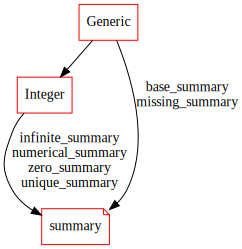
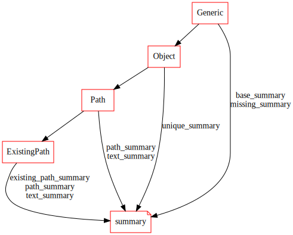
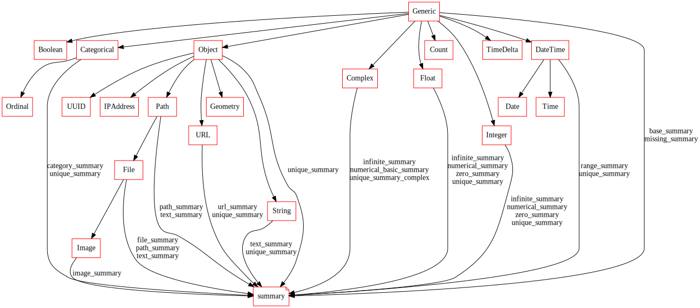

Application view
================

This section discusses viewing the concepts of `visions` with respect to subsequent application.
We find this view intuitive to create understanding of:

- for what we want to create types, typesets and relations
- the benefits of using visions in practise

It is limited for:

- abstracter concepts

Applications
------------
Applications are broad.
We explain using analytics use cases, as this was the original motivation (pandas-profiling).

Descriptive statistics
----------------------

TODO

Integer
~~~~~~~

   Integer Summary Graph

Existing Path
~~~~~~~~~~~~~

   Existing Path Summary Graph

Typeset summary graphs
----------------------

Complete Typeset
~~~~~~~~~~~~~~~~

   CompleteTypeset Summary Graph

Predictive analytics (including machine learning)
-------------------------------------------------

One hot encoding, etc.