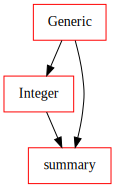
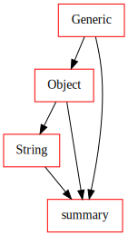

Application view
================

This section discusses viewing the concepts of `visions` with respect to subsequent application.
We find this view intuitive to create understanding of:

- for what we want to create types, typesets and relations
- the benefits of using visions in practice

It is limited for:

- abstract concepts

Applications
------------
The potential applications for `visions` are broad.
The motivating use case came from analytics (specifically pandas-profiling) so we will start with descriptive statistics.
Then, we will shortly touch predictive analytics/machine learning and reducing memory footprint.

Descriptive statistics
----------------------

In descriptive statistics we are looking for coefficients that summarize our data.
Describing numbers (for instance through the five-number summary) is completely different from describing strings.

The application is designed that each type in a typeset is associated with summary functions.
The summary of a sequence is the combination of all summary functions of the type and all its super types.
Examples from Integer, String, ExistingPath are given below.

Integer
~~~~~~~

   Integer Summary Graph

String
~~~~~~

   String Summary Graph

Notably, the `text_summary` obtains awesome unicode statistics from another package within this project: `tangled up in unicode <https://github.com/dylan-profiler/tangled-up-in-unicode>`_.
If you are working with text data, you definitely want to check it out.

Existing Path
~~~~~~~~~~~~~

.. figure:: ../../../../src/visions/visualisation/summaries/summary_existing_path.svg
   :width: 300 px
   :align: center
   :alt: Existing Path Summary Graph

   Existing Path Summary Graph

Typeset summary graphs
----------------------

We can visualise the summary functions for the a typeset, too.

Complete Typeset
~~~~~~~~~~~~~~~~

.. figure:: ../../../../src/visions/visualisation/summaries/summary_complete.svg
   :width: 700 px
   :align: center
   :alt: CompleteTypeset Summary Graph

   CompleteTypeset Summary Graph

Machine learning
----------------

In predictive analytics and machine learning, variables are processed and encoded differently.
The default typesets in `visions` are an useful abstraction to base the encoding and preprocessing steps on.
For example categorical values are one-hot or `dummy coded <https://en.wikipedia.org/wiki/Categorical_variable#Dummy_coding>`_, while ordinals can be `encoded as integer <https://scikit-learn.org/stable/modules/generated/sklearn.preprocessing.OrdinalEncoder.html#sklearn.preprocessing.OrdinalEncoder>`_.

Reducing Memory Footprint
-------------------------

A typeset can be an useful abstraction to reduce memory required for a dataset.
There are two dynamics that can help.

Relations
~~~~~~~~~

The first is by defining semantically-equivalent inferential relations from generalist to specialist types.
The default typeset contains examples of those relations:

- from complex to float when the imaginary part is equal to zero
- from float to integer when the there is no fractional component
- from integer to boolean when the values are binary

Note that the user needs to decide if these relations are semantically equivalent given his/her dataset.

Type Conversion
~~~~~~~~~~~~~~~

The second dynamic is by minimizing the memory used for a single type.
We can define a (lossless) conversion operation for specific types.
For example, we could convert a 64-bit integer to a 8-bit integer if it contains only pixel values.