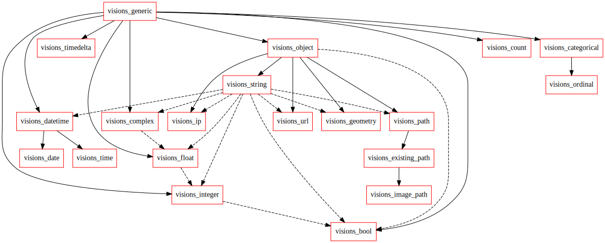

Graph View
==========

Type consist of
    - one node
    - one inheritance edge
    - zero or more conversion edges

A typeset:
    Set of types
    Directed Acyclic Graph

Visions (Complete)
------------------

   CompleteTypeset Graph